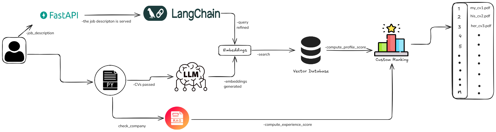

## 🏗️ TalentSort Architecture

📄 TalentSort: AI-Powered CV Sorting App

🚀 TalentSort is a FastAPI-based web application that processes CVs from a given folder and enables semantic search using FAISS and Sentence Transformers. It leverages LangChain and Together AI to enhance job-matching with AI-powered query refinement.

🚀 Features

✅ Load CVs dynamically from a specified folder✅ Perform semantic search across CVs using FAISS✅ AI-powered query enhancement via Together AI✅ Process multiple PDF resumes at once✅ REST API for easy integration

📦 Installation

1️⃣ Clone the Repository

git clone https://github.com/your-username/talentsort.git
cd talentsort

2️⃣ Set Up a Virtual Environment

# For Conda
conda create --name talentsort_backend python=3.9 -y
conda activate talentsort_backend

# OR, For venv
python -m venv venv
source venv/bin/activate  # Windows: venv\Scripts\activate

3️⃣ Install Dependencies

pip install -r requirements.txt

4️⃣ Set Up .env File

Create a .env file in the project root and add your Together AI API key:

TOGETHER_API_KEY=your_together_ai_api_key
SERPAPI_KEY=yourserp_api_key

🔑 Get your API Key from Together AI

🚀 Running the App

Start the FastAPI Server

uvicorn main:app --reload --host 0.0.0.0 --port 8000

The API will now be available at:

Docs: http://127.0.0.1:8000/docs

Redoc UI: http://127.0.0.1:8000/redoc

📂 API Endpoints

1️⃣ Load a Folder with CVs & Search Immediately

This scans and indexes all PDFs from the given folder and performs a search.

Request

curl -X POST "http://127.0.0.1:8000/search/" \
-H "accept: application/json" \
-H "Content-Type: application/json" \
-d '{
  "folder_path": "E:/Job/CV/V4-new/",
  "query": "Machine Learning Engineer with Python and TensorFlow experience"
}'

Response

{
  "original_query": "Machine Learning Engineer with Python and TensorFlow experience",
  "refined_query": "Find resumes with deep learning expertise and TensorFlow experience.",
  "results": [
    {
      "filename": "Candidate1.pdf",
      "score": 1.7708501815795898,
      "text_snippet": "John Doe, AI Engineer with 5+ years of experience..."
    }
  ]
}

2️⃣ Upload a New CV

This adds a new CV to the existing index.

Request

curl -X POST "http://127.0.0.1:8000/upload/" \
-H "accept: application/json" \
-H "Content-Type: multipart/form-data" \
-F "file=@path/to/your_cv.pdf"

Response

{
  "file_id": "abc123",
  "message": "File uploaded successfully"
}
🔥 Technologies Used

TalentSort is built using a combination of cutting-edge AI, NLP, and backend technologies to ensure fast and accurate resume searching.

Backend

FastAPI: A high-performance web framework for building APIs with Python.

Uvicorn: An ASGI web server to run the FastAPI application.

Artificial Intelligence & NLP

Sentence Transformers: Used to generate meaningful text embeddings for semantic search.

FAISS: A vector search engine optimized for fast nearest neighbor searches.

LangChain: Enhances query understanding and retrieval-based generation.

Together AI: Provides access to large language models (LLMs) for query refinement and ranking.

Data Handling

pdfplumber: Extracts text from PDF resumes efficiently.

NumPy: Handles numerical operations for embedding and FAISS search.

Deployment & Infrastructure

Python 3.9+: The core programming language used for development.

dotenv: Manages API keys and environment variables securely.

🔥 Tech Stack

Backend: FastAPI

AI & NLP: Sentence Transformers, FAISS, LangChain

Embeddings: MiniLM (all-MiniLM-L6-v2)

Cloud AI: Together AI (LLM-powered query enhancement)

Data Handling: pdfplumber, NumPy

Deployment: Uvicorn

📌 Next Steps

🔄 Enhance search ranking with multi-vector embeddings

🌐 Add a Web UI (React or Streamlit)

📊 Analyze candidate trends via AI-generated summaries

🛠 Troubleshooting

1️⃣ API Key Not Found

Ensure .env contains:

TOGETHER_API_KEY=your_together_ai_api_key

Run:

source .env  # Linux/macOS
set TOGETHER_API_KEY=your_together_ai_api_key  # Windows

2️⃣ Port Already in Use

kill $(lsof -t -i:8000)  # macOS/Linux
netstat -ano | findstr :8000  # Windows

🤝 Contributing

Contributions are welcome! Feel free to open an issue or submit a pull request.

📝 License

MIT License © 2025 Shayekh Mohiuddin Ahmed Navid
